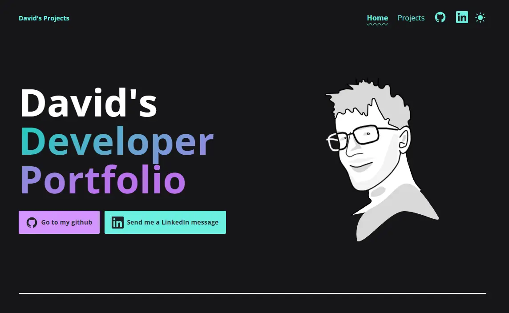

# My personal portfolio

🚀 [Live Preview](https://david-abell.github.io/personal-portfolio/)

## 🚀 Getting started

Clone this repo locally and run any of the following commands in your terminal:

| Command           | Action                                       |
| :---------------- | :------------------------------------------- |
| `npm install`     | Installs dependencies                        |
| `npm run dev`     | Starts local dev server at `localhost:3000`  |
| `npm run build`   | Build your production site to `./dist/`      |
| `npm run preview` | Preview your build locally, before deploying |

## 📦 Other Accessible Astro projects

## ❤️ Helping out

## ☕ Thank you!

Thanks to the accessible astro starter creater Mark Teekman :)

Design inspirations from Fred Nerby, Rob Owen, and Will Boyd

1. [Accessible Astro Starter](https://github.com/markteekman/accessible-astro-starter/)
2. [Fred Nerby](https://nerby.com)
3. [Rob Owen](https://robbowen.digital)
4. [Will Boyd](https://codersblock.com)
